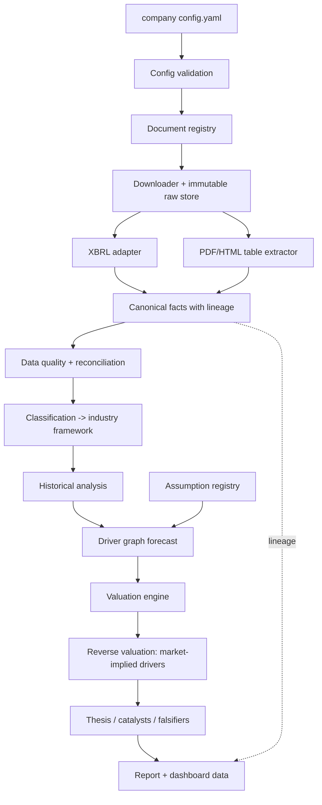

# Architecture

## Layers



Phase 1 implements A–C, the schemas for F and K, the framework system for H, and the lineage graph used by O.

## Package map

```
src/research_engine/
  schemas/      company, document, financial (facts, periods, lineage locations), assumption, framework
  config/       YAML loading and path resolution
  frameworks/   framework loading, inheritance, reference validation, SIC candidates
  registry/     SQLite document registry, content-addressed raw store
  lineage/      lineage DAG
  expressions.py  whitelisted-AST arithmetic for derivations and driver formulas
  cli.py        validate | frameworks | research
industry_frameworks/   metrics, drivers, valuation policy per industry (data)
companies/             one directory per company (data)
```

## Key decisions

| # | Decision | Why | Cost |
|---|---|---|---|
| D1 | Structured filings (XBRL) are the primary numeric source; PDFs are secondary | Generic PDF table extraction across arbitrary issuers is unreliable and is what paid vendors sell. XBRL gives tagged values with contexts, units and periods | Non-XBRL issuers and custom KPIs need the slower PDF path |
| D2 | Facts are immutable; ids include the source | Restatements must coexist so history is auditable | Consumers need a selection policy (latest filing wins, earlier retained) |
| D3 | Reported vs derived enforced in the schema, not by convention | A derived number cannot be saved without inputs and a formula | Slightly more verbose extraction code |
| D4 | Periods distinguish `instant` from `duration` | Balance-sheet and flow values are not comparable otherwise; mirrors XBRL contexts | None meaningful |
| D5 | Frameworks are YAML with single inheritance and explicit removals | Banks inherit what applies and drop COGS/FCF/EV concepts that do not | Deep hierarchies would get hard to reason about; kept to one level |
| D6 | Formulas parsed with a whitelisted AST, evaluated in Decimal | Frameworks are data and must not execute code; Decimal avoids float drift in accounting identities | No exponentiation or functions (add deliberately if needed) |
| D7 | Content-addressed, read-only raw store; changed content is refused | "Never overwrite raw documents"; hashes double as the download cache key | A changed URL must be registered as a new document version |
| D8 | Deterministic document and fact ids | Idempotent re-runs and cache hits | Id changes if the source key changes |
| D9 | Assumption types carry source requirements | Guidance/consensus cannot be fabricated or mislabeled | Analysts must write rationales |
| D10 | The engine quantifies theses; analysts author them | An automated "variant view" is either boilerplate or unsourced inference, which contradicts the no-fabrication rule | Each company needs human input before a report is meaningful |

## Invariants tested

- No configured company identifier appears in `src/` or `industry_frameworks/`.
- No code branches on ticker/name/CIK.
- A new company validates with only a config file.
- Every shipped framework resolves with no dangling references or circular derivations.
