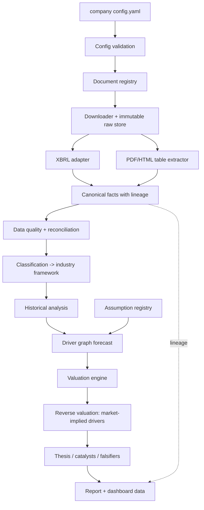

# Architecture

## Layers



Phases 1–4 implement A–D, E1, F, G, SIC-based H, I (historical analysis), the schemas for K, and lineage through charts.

## Package map

```
src/research_engine/
  schemas/      company, document, financial (facts, periods, lineage locations), assumption, framework
  config/       YAML loading and path resolution
  frameworks/   framework loading, inheritance, reference validation, SIC candidates
  registry/     SQLite document registry, content-addressed raw store
  lineage/      lineage DAG
  sources/      pluggable structured-data adapters (SEC submissions, SEC companyfacts)
  ingestion/    hardened HTTP fetcher, .env loader
  extraction/   XBRL observations -> canonical facts
  pipeline/     ingestion orchestration and output writers
  calendar.py   fiscal calendar (dates -> fiscal periods)
  quality/      derived facts, identity and continuity checks, HTML report
  analysis/     historical analytics, summaries, charts, Markdown tables
  classification.py  framework selection (override > SIC > generic)
  expressions.py  whitelisted-AST arithmetic for derivations and driver formulas
  cli.py        validate | frameworks | research
industry_frameworks/   metrics, drivers, valuation policy per industry (data)
companies/             one directory per company (data)
```

## Key decisions

| # | Decision | Why | Cost |
|---|---|---|---|
| D1 | Structured filings (XBRL) are the primary numeric source; PDFs are secondary | Generic PDF table extraction across arbitrary issuers is unreliable and is what paid vendors sell. XBRL gives tagged values with contexts, units and periods | Non-XBRL issuers and custom KPIs need the slower PDF path |
| D2 | Facts are immutable; ids include the source | Restatements must coexist so history is auditable | Consumers need a selection policy (latest filing wins, earlier retained) |
| D3 | Reported vs derived enforced in the schema, not by convention | A derived number cannot be saved without inputs and a formula | Slightly more verbose extraction code |
| D4 | Periods distinguish `instant` from `duration` | Balance-sheet and flow values are not comparable otherwise; mirrors XBRL contexts | None meaningful |
| D5 | Frameworks are YAML with single inheritance and explicit removals | Banks inherit what applies and drop COGS/FCF/EV concepts that do not | Deep hierarchies would get hard to reason about; kept to one level |
| D6 | Formulas parsed with a whitelisted AST, evaluated in Decimal | Frameworks are data and must not execute code; Decimal avoids float drift in accounting identities | No exponentiation or functions (add deliberately if needed) |
| D7 | Content-addressed, read-only raw store; changed content is refused | "Never overwrite raw documents"; hashes double as the download cache key | A changed URL must be registered as a new document version |
| D8 | Deterministic document and fact ids | Idempotent re-runs and cache hits | Id changes if the source key changes |
| D9 | Assumption types carry source requirements | Guidance/consensus cannot be fabricated or mislabeled | Analysts must write rationales |
| D10 | The engine quantifies theses; analysts author them | An automated "variant view" is either boilerplate or unsourced inference, which contradicts the no-fabrication rule | Each company needs human input before a report is meaningful |

| D11 | Fiscal periods come from start/end dates and the fiscal year end, never SEC's `fy`/`fp` | `fy`/`fp` describe the filing: a FY2025 10-K tags its FY2024 comparative with fy=2025 | Requires a known fiscal year end (config or SEC submissions) |
| D12 | Changed source content becomes a new document version that supersedes the old | API snapshots like companyfacts change with every filing; Phase 1's refusal would have blocked refreshes | Registry grows with each changed snapshot |
| D13 | Keep first disclosure of each distinct value; different values for a period are restatements, both kept | Comparatives repeat values across filings; restatements must remain visible | "Current" is a view (latest filed), not the stored truth |
| D14 | Per period, the highest-ranked concept wins; lower-ranked ones are recorded as shadowed | Mixing `Revenues` and contract-revenue tags silently changes definitions | Concept switches across years are flagged, not reconciled |
| D15 | Identity (CIK in URL, ticker, fiscal year end) is verified before facts are trusted | Wrong-company data is the most damaging silent failure | A ticker change requires a config update |

| D16 | Accounting identities are framework data (`checks:`), limited to + and − | Banks, insurers and industrials need different identities; additive form is what makes a principled rounding tolerance possible | Ratio sanity checks need a different mechanism |
| D17 | Tolerance = n × inferred presentation unit / 2, unit capped at 10^6 | Derives the threshold from how filers round, rather than a tuned percentage | Unit is inferred, not read from XBRL `decimals` (absent in companyfacts) |
| D18 | Missing inputs are counted as "not evaluable" | A check with no data must not look like a pass | Reports show three numbers per check instead of one |
| D19 | Derived facts never replace reported ones; where both exist and the definition is additive, they are compared | Keeps reported data authoritative while surfacing definition differences | Filer-specific definitions show up as warnings to triage |
| D20 | Outlier and scale rules are statistical conventions with stated parameters (modified z > 3.5; 10^3k ± 0.2 log10) | Spec forbids arbitrary thresholds; these are traceable and adjustable in one place | Flags are prompts for review, not conclusions |

| D21 | Framework metrics are financial quantities (and company-reported operating ratios); engine-computed ratios are analytics | One place for each concept; avoids two ROEs with different definitions | Moved 11 Phase 3 metric derivations into analytics |
| D22 | A metric derivation may not mix flows and balances; ratios with balance denominators declare `average` or `opening` | Dividing a year of income by one day's balance misstates returns whenever the balance sheet moves | Averages need a prior year-end, so the first year of history is not computed (labelled `start_of_history`) |
| D23 | Non-positive denominators and growth bases are not computed | Margins on negative revenue or returns on negative equity have no interpretation | Distressed companies show gaps rather than misleading numbers |
| D24 | Error-severity data-quality issues block their facts; warnings propagate as flags to every dependent value and chart point | Analysis should never silently rest on data that failed a hard check | Flags accumulate through chained analytics |
| D25 | Stages verify framework and upstream manifest hashes before running | A framework edited after ingestion would silently change mappings | Any framework edit requires re-running `ingest` |
| D26 | Charts are framework data; derived points are hollow/hatched, flagged points carry † | The chart itself discloses provenance, not only the appendix | Fixed visual grammar across industries |

## Invariants tested

- No configured company identifier appears in `src/` or `industry_frameworks/`.
- No code branches on ticker/name/CIK.
- A new company validates with only a config file.
- Every shipped framework resolves with no dangling references or circular derivations.
- Restated values are never overwritten; comparatives never duplicate facts.
- Every skipped XBRL observation is counted under a reason.
- Wrong CIK fails before any network call; wrong ticker fails before extraction.
- A derived quarter traces through its inputs to source URLs.
- Loosening the tolerance, skipping derived facts in sign checks, or disabling the consistency check each fails tests (verified by mutation).
- A chart traces chart → analytic value → fact → document → source URL.
- Replacing the average basis with closing balances, disabling the quality gate, allowing negative denominators, or allowing flow-to-balance derivations each fails tests (verified by mutation).
